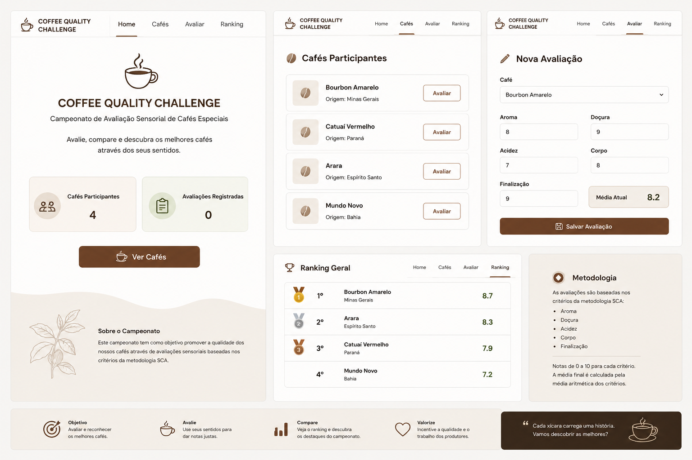

# ☕ IFC Coffee Quality Challenge 2026



## Links de Apoio

- [Link - Quadro de Tarefas](https://github.com/users/cristofersousa/projects/1)
- [Link - Surge](https://ifc-cafe.surge.sh/)

```sh
README.md
│
├── O que é o projeto?
├── Como executar?
├── Onde está a documentação?
│
└── docs/
    ├── contexto
    ├── requisitos
    ├── backlog
    ├── wireframes
    ├── entrega
    └── critérios

```

## Sobre o Projeto

A Specialty Coffee Association (SCA) realiza campeonatos de avaliação sensorial para determinar a qualidade de cafés especiais.

Neste desafio você fará parte da **Squad Colmeia**, equipe responsável pelo desenvolvimento da primeira versão do sistema **Coffee Quality Challenge 2026**.

Seu objetivo será desenvolver uma aplicação utilizando Vue.js para auxiliar juízes na avaliação dos cafés participantes e permitir a visualização do ranking do campeonato.

O sistema deve permitir que os usuários:

- Visualizem os cafés participantes;
- Registrem avaliações;
- Consultem o ranking final;
- Naveguem entre as páginas utilizando **Vue Router**.

---

## Objetivos de Aprendizagem

Durante esta atividade você deverá demonstrar conhecimentos sobre:

- Vue.js
- Componentização
- Templates
- Reatividade
- Listas
- Vue Router
- Organização de projetos Front-end

---

## Tecnologias

- Vue 3
- Vue Router
- Vite
- JavaScript
- HTML
- CSS

---

## Tempo de Desenvolvimento

⏱️ Tempo estimado: **2 horas**

---

# 📚 Documentação do Projeto

Toda a documentação necessária para desenvolvimento encontra-se na pasta `docs`.

## Documentos

### 01 - Contexto

Descrição do problema de negócio e visão geral do produto.

➡️ [Abrir Contexto](./docs/01-contexto.md)

---

### 02 - Requisitos Funcionais

Lista completa de funcionalidades esperadas.

➡️ [Abrir Requisitos Funcionais](./docs/02-requisitos-funcionais.md)

---

### 03 - Critérios de Avaliação

Como o projeto será corrigido.

➡️ [Abrir Critérios de Avaliação](./docs/03-criterios-avaliacao.md)

---

### 04 - Wireframes

Protótipos visuais das telas.

➡️ [Abrir Wireframes](./docs/04-wireframes.md)

---

### 05 - Backlog

Lista de tarefas e histórias da Sprint.

➡️ [Abrir Backlog](./docs/05-backlog.md)

---

### 06 - Entrega

Instruções para submissão do projeto.

➡️ [Abrir Entrega](./docs/06-entrega.md)

---

# Guia - Estrutura do Repositório:

```txt
ifc-coffee-quality-desafio/
│
├── README.md
│
└── docs/
    ├── 01-contexto.md
    ├── 02-requisitos-funcionais.md
    ├── 03-criterios-avaliacao.md
    ├── 04-wireframes.md
    ├── 05-backlog.md
    ├── 06-entrega.md
    └── imagens/
```

# Referências

Material de guia para desenvolvimento deve ser adotado do Professor Fábio Longo, que se encontra neste repositório [link](https://github.com/ldmfabio/devweb-II) que é referente a disciplina DEV Web II.

---

# Boa sorte!

Agora você faz parte da **Squad Colmeia**.

O Product Owner entregou os requisitos.

Os wireframes foram aprovados.

O backlog já está priorizado.

🚀 Sua missão é entregar a primeira versão do Coffee Quality Challenge.
