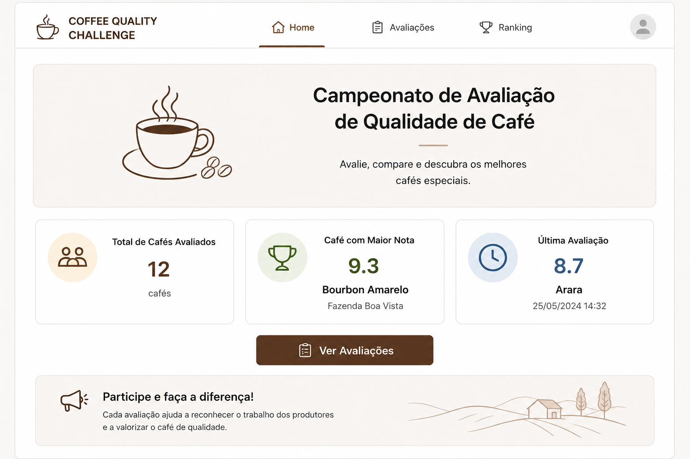
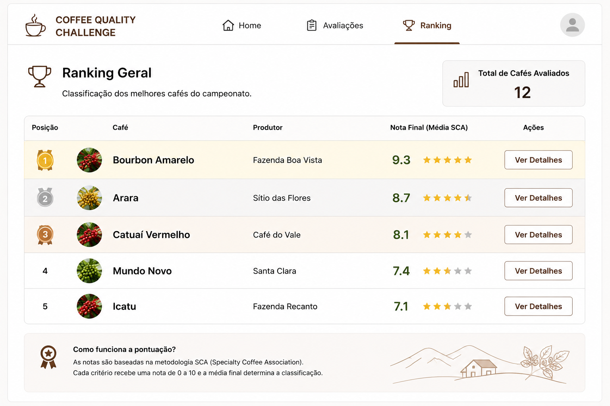
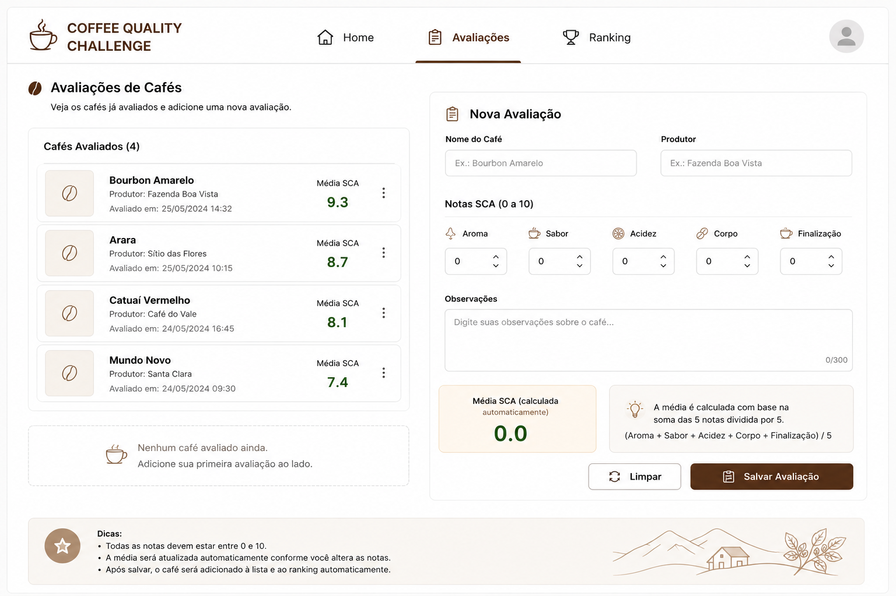

# ☕ IFC-Coffee Quality Challenge


## Descrição

Uma cooperativa de cafés especiais está realizando um campeonato interno para avaliar a qualidade de diferentes amostras de café.

Cada café participante será analisado por avaliadores que atribuirão notas para critérios sensoriais inspirados em metodologias utilizadas na avaliação de cafés especiais.

Seu objetivo é desenvolver uma aplicação utilizando **Vue.js** para auxiliar na organização dessas avaliações e exibir um ranking dos cafés participantes.

O sistema deve permitir que os usuários:

* Visualizem os cafés participantes;
* Registrem avaliações;
* Consultem o ranking final;
* Naveguem entre as páginas utilizando **Vue Router**.


```sh
ifc-coffee-quality-desafio/
│
├── README.md
│
docs/
├── 01-contexto.md
├── 02-requisitos-funcionais.md
├── 03-criterios-avaliacao.md
├── 04-wireframes.md
├── 05-backlog.md
├── 06-entrega.md
└── imagens/
    ├── home.png
    ├── avaliacoes.png
    ├── ranking.png
    └── detalhes.png
```

# Objetivo

Desenvolver uma aplicação Vue.js que permita:

1. Visualizar os cafés participantes;
2. Realizar avaliações dos cafés;
3. Calcular a média das avaliações;
4. Exibir um ranking dos cafés avaliados.

---

# Regras de Negócio

Cada café deve possuir:

* Nome;
* Região de Origem.

Cada avaliação deve conter notas de **0 a 10** para os seguintes critérios:

* Aroma
* Doçura
* Acidez
* Corpo
* Finalização

A média final do café será calculada através da fórmula:

```text
(Aroma + Doçura + Acidez + Corpo + Finalização) / 5
```

---

# Requisitos Técnicos

A aplicação deve utilizar os conceitos estudados durante a disciplina.

## Templates

Utilizar pelo menos:

```vue
v-model
v-if
v-for
```

## Componentes

Criar pelo menos dois componentes reutilizáveis:

### CoffeeCard.vue

Responsável por exibir as informações de um café.

### RankingItem.vue

Responsável por exibir uma posição no ranking.


# Dados Iniciais

Utilize os seguintes cafés como base da aplicação:

```javascript
[
  {
    id: 1,
    nome: "Bourbon Amarelo",
    origem: "Minas Gerais"
  },
  {
    id: 2,
    nome: "Catuaí Vermelho",
    origem: "Paraná"
  },
  {
    id: 3,
    nome: "Arara",
    origem: "Espírito Santo"
  },
  {
    id: 4,
    nome: "Mundo Novo",
    origem: "Bahia"
  }
]
```

---

# Wireframe



## Página Inicial (/)

```text
+--------------------------------------------------+
|                                                  |
|        COFFEE QUALITY CHALLENGE                  |
|                                                  |
| Avaliação Sensorial de Cafés Especiais           |
|                                                  |
| Cafés Participantes: 4                           |
|                                                  |
| [ Ver Cafés ]                                    |
|                                                  |
+--------------------------------------------------+
```

---

## Página Cafés (/cafes)




```text
+--------------------------------------------------+
|                     CAFÉS                        |
+--------------------------------------------------+

+--------------------------+
| Bourbon Amarelo          |
| Minas Gerais             |
|                          |
| [ Avaliar ]              |
+--------------------------+

+--------------------------+
| Catuaí Vermelho          |
| Paraná                   |
|                          |
| [ Avaliar ]              |
+--------------------------+

+--------------------------+
| Arara                    |
| Espírito Santo           |
|                          |
| [ Avaliar ]              |
+--------------------------+
```

---

## Página Avaliação (/avaliar)




```text
+--------------------------------------------------+
|               NOVA AVALIAÇÃO                     |
+--------------------------------------------------+

Café:

[ Bourbon Amarelo         ▼ ]

Aroma:
[ 8 ]

Doçura:
[ 9 ]

Acidez:
[ 7 ]

Corpo:
[ 8 ]

Finalização:
[ 9 ]

[ Salvar Avaliação ]
```

---

## Página Ranking (/ranking)

```text
+--------------------------------------------------+
|                    RANKING                       |
+--------------------------------------------------+

🏆 1º Bourbon Amarelo ........ 8.7

🥈 2º Arara .................. 8.3

🥉 3º Catuaí Vermelho ........ 7.9

4º Mundo Novo ............... 7.2
```

---


# Desafios Extras (Opcional)

## Extra 1

Exibir uma mensagem de destaque quando a média for maior ou igual a 8.

Exemplo:

```text
Excelente Café ☕
```

Utilizar:

```vue
v-if
```

---

## Extra 2

Permitir o cadastro de novos cafés.

Utilizar:

```vue
v-model
v-for
```

---

## Extra 3

Destacar visualmente o primeiro colocado do ranking.

Exemplo:

```text
🏆 Campeão do Campeonato
```

---

# Critérios de Avaliação

| Critério              | Pontos |
| --------------------- | -----: |
| Estrutura Vue correta |      1 |
| Uso de Templates      |      1 |
| Uso de v-model        |      2 |
| Uso de v-if           |      1 |
| Uso de v-for          |      2 |
| Componentização       |      3 |
| Rotas                 |      3 |
| Organização do código |      2 |
| **Total**             | **15** |

---